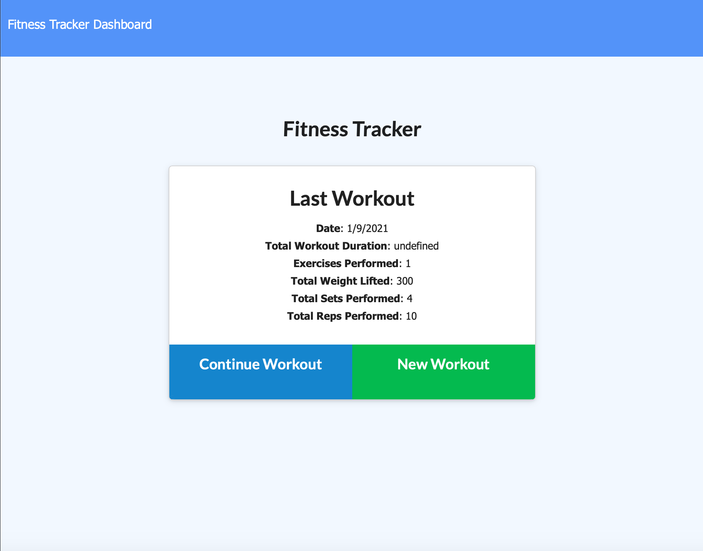
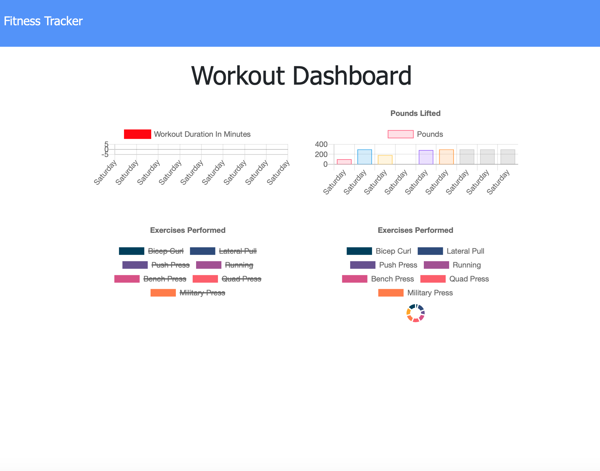

# stay-fit

## Table of Contents

- [Description](#description)
- [User Story](#user-story)
- [Image](#image)
- [Installation](#installation)
- [License MIT](#licensemit)

## Description

This app allows a user to track their workouts and see stats on their past 7 workouts. The user can choose to view stats, continue the last workout or start a new one.

## User Story

* As a user, I want to be able to view create and track daily workouts. I want to be able to log multiple exercises in a workout on a given day. I should also be able to track the name, type, weight, sets, reps, and duration of exercise. If the exercise is a cardio exercise, I should be able to track my distance traveled.

## Image

## Installation

To access this application you must visit this link: [Served via Heroku](https://nameless-ridge-85207.herokuapp.com/) or to install visit my GitHub page and locate the repository named "note-taker". Once this repository is cloned to your computer, you will be able to edit the files and/or run it on a server. Any questions can be directed to [Garrett Walter](mailto:gtwalter150@gmail.com). This project can be found here: [GitHub Repository](https://github.com/garrettwalter/stay-fit)

## License MIT

Copyright 2020 Garrett Walter

Permission is hereby granted, free of charge, to any person obtaining a copy of this software and associated documentation files 
(the "Software"), to deal in the Software without restriction, including without limitation the rights to use, copy, modify, merge, 
publish, distribute, sublicense, and/or sell copies of the Software, and to permit persons to whom the Software is furnished to do so, 
subject to the following conditions:
        
The above copyright notice and this permission notice shall be included in all copies or substantial portions of the Software.
THE SOFTWARE IS PROVIDED "AS IS", WITHOUT WARRANTY OF ANY KIND, EXPRESS OR IMPLIED, INCLUDING BUT NOT LIMITED TO THE WARRANTIES
OF MERCHANTABILITY, FITNESS FOR A PARTICULAR PURPOSE AND NONINFRINGEMENT. IN NO EVENT SHALL THE AUTHORS OR COPYRIGHT HOLDERS BE 
LIABLE FOR ANY CLAIM, DAMAGES OR OTHER LIABILITY, WHETHER IN AN ACTION OF CONTRACT, TORT OR OTHERWISE, ARISING FROM, OUT OF OR IN 